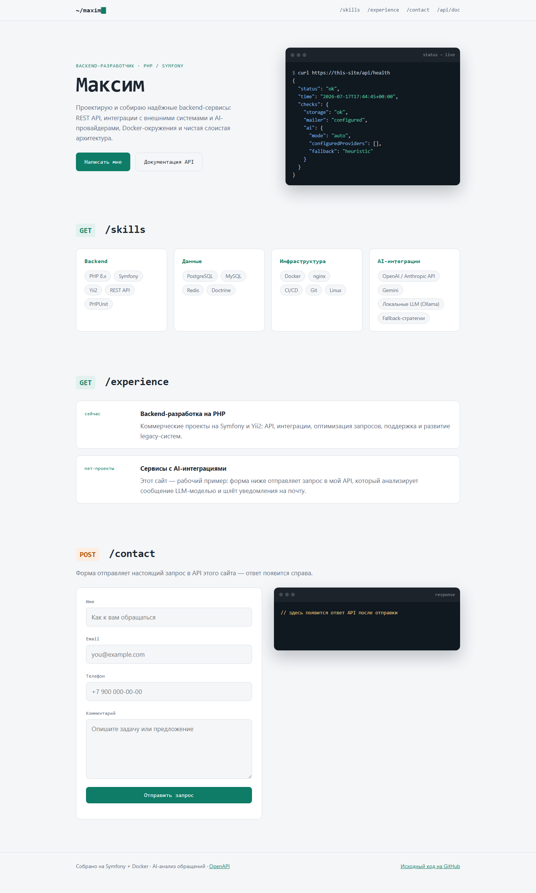
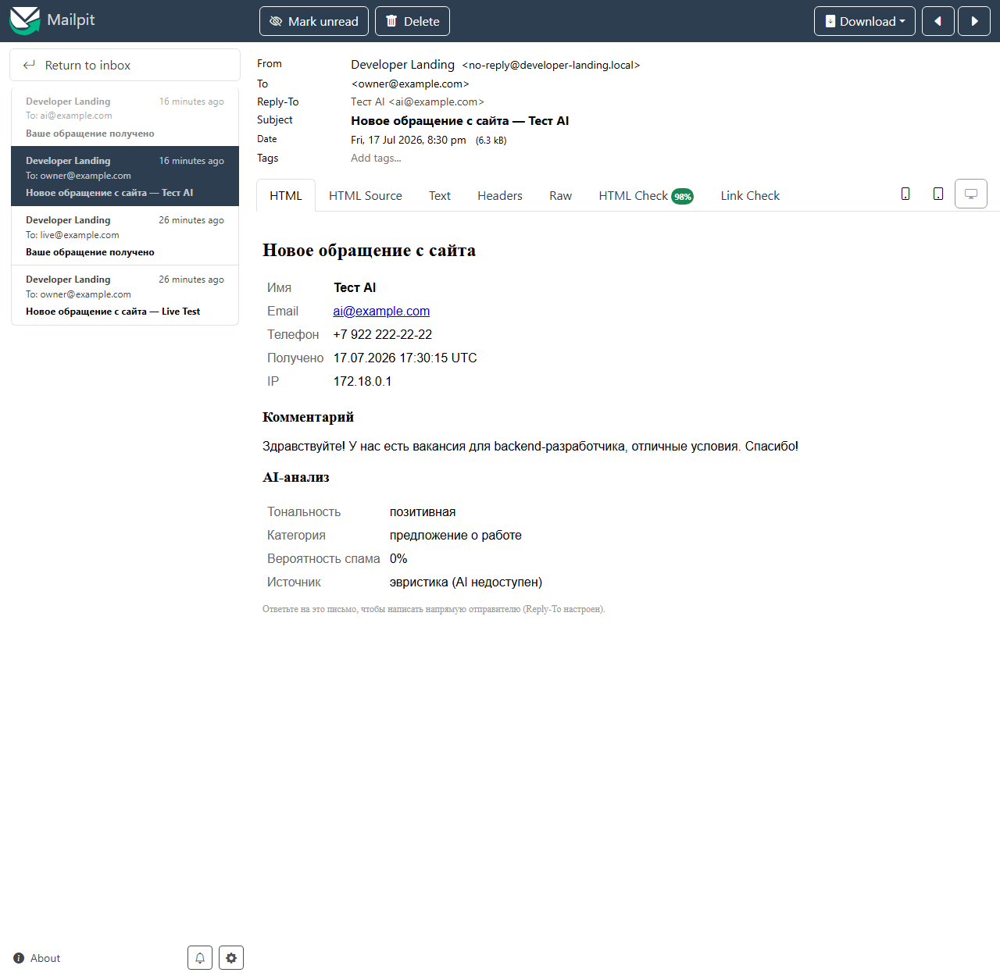
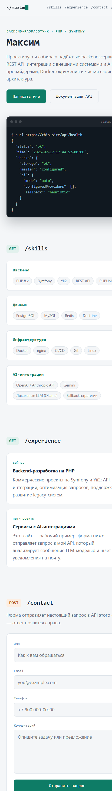
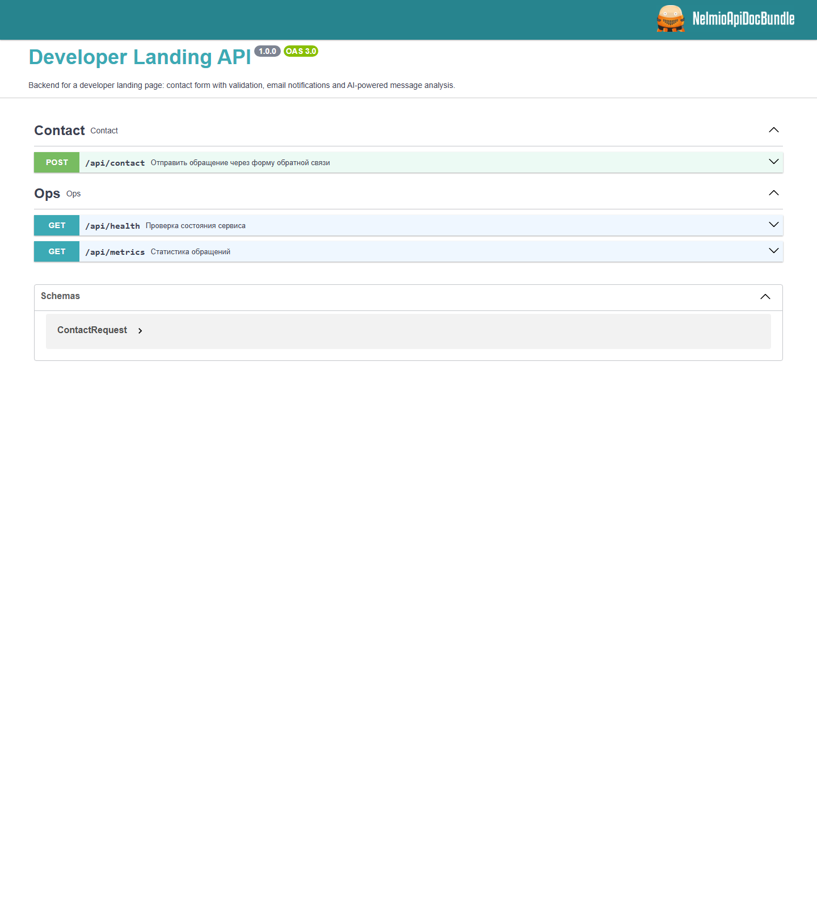

# Developer Landing API

[](https://github.com/Enrinko/developer-landing-api/actions/workflows/ci.yml)

Backend-сервис для лендинга-презентации разработчика (тестовое задание): REST API формы
обратной связи с валидацией, email-уведомлениями, AI-анализом обращений (5 провайдеров с
graceful fallback), rate limiting, файловым хранением и логированием. Плюс сам лендинг,
который живьём демонстрирует работу API.



---

## 1. Как запустить проект

Единственный поддерживаемый способ запуска — Docker. Локально ничего, кроме Docker и git,
устанавливать не нужно.

```bash
git clone https://github.com/Enrinko/developer-landing-api.git
cd developer-landing-api
docker compose up -d --build
docker compose exec app composer install
```

После этого:

| URL | Что это |
|---|---|
| http://localhost:8080 | Лендинг с рабочей формой |
| http://localhost:8080/api/doc | Swagger UI (OpenAPI) |
| http://localhost:8025 | Mailpit — все отправленные письма |

> Базовые образы берутся из зеркала `public.ecr.aws` — сборка работает и там, где
> `docker.io` недоступен.

### Переменные окружения

Безопасные значения по умолчанию лежат в `app/.env` (коммитится). Секреты — в
`app/.env.local` (в `.gitignore`); шаблон: `app/.env.local.example`.

```bash
cp app/.env.local.example app/.env.local
# впишите хотя бы один AI-ключ — например, бесплатный Gemini
```

Ключевые переменные:

| Переменная | Значение по умолчанию | Назначение |
|---|---|---|
| `AI_PROVIDER` | `auto` | `auto` / `gemini` / `anthropic` / `openai` / `groq` / `ollama` / `off` |
| `GEMINI_API_KEY` и др. | пусто | ключи провайдеров (см. раздел AI) |
| `MAILER_DSN` | Mailpit в dev | SMTP для реальной отправки |
| `MAIL_OWNER` | `owner@example.com` | адрес владельца сайта |
| `RATE_LIMIT_CONTACT_LIMIT` / `_INTERVAL` | `5` / `15 minutes` | лимит формы на IP |

### Команды разработки

```bash
make test      # PHPUnit (42 теста)
make stan      # PHPStan, level 8
make cs        # проверка код-стайла (PHP-CS-Fixer)
make sh        # shell внутри контейнера
# без make: docker compose exec app php bin/phpunit  и т.д.
```

---

## 2. Стек технологий

**Backend:** PHP 8.5, Symfony 7.4 LTS (validator, mailer + Twig-шаблоны писем,
http-client, rate-limiter, monolog, serializer, uid), NelmioApiDocBundle (OpenAPI),
NelmioCorsBundle (CORS).

**Качество:** PHPUnit 13 (42 теста: functional + unit), PHPStan level 8 (+ symfony
extension), PHP-CS-Fixer (@Symfony), GitHub Actions CI — линт, статанализ и тесты гоняются
в тех же контейнерах, что и локально; отдельный job собирает прод-образ.

**Инфраструктура:** Docker Compose (php-fpm 8.5-alpine → multi-stage dev/prod/serve,
nginx, Mailpit), Makefile с каноничными командами.

**AI:** Google Gemini, Anthropic Claude, OpenAI, Groq, Ollama — через чистый
`symfony/http-client`, без SDK (см. раздел 5).

Почему Symfony: фреймворк из списка ТЗ, слоистая архитектура и DI из коробки, компонент
rate-limiter с файловым storage ровно под требование ТЗ. Почему без БД: ТЗ явно разрешает
файловое хранение; шов `ContactSubmissionRepositoryInterface` позволяет заменить файлы на
Postgres, не трогая сервисный слой (см. Trade-offs).

---

## 3. Архитектура

Слоистая структура (требование ТЗ): `Controller → Service → Repository / Providers`.

```
app/src/
├── Controller/Api/        # edge: HTTP, маппинг DTO, никакой бизнес-логики
│   ├── ContactController.php
│   ├── HealthController.php
│   └── MetricsController.php
├── Dto/ContactRequest.php # валидация на входе (MapRequestPayload + constraints)
├── Model/                 # доменные объекты: ContactSubmission, AiAnalysis, enum'ы
├── Service/
│   ├── ContactService.php # оркестрация: анализ → сохранение → письма → ответ
│   ├── ContactMailer.php  # письма владельцу и пользователю
│   ├── HealthReporter.php / MetricsCalculator.php
│   └── Ai/
│       ├── ChainAiAnalyzer.php      # цепочка провайдеров + fallback
│       ├── HeuristicAnalyzer.php    # финальный fallback без сети
│       ├── AiPrompt.php / AiResponseParser.php
│       └── Provider/                # Gemini, Anthropic, OpenAI/Groq/Ollama
├── Repository/            # шов хранения: интерфейс + JSONL-реализация
└── EventListener/         # error envelope, request-лог, rate limit
```

Паттерны — и зачем они здесь:

- **Repository** — `ContactSubmissionRepositoryInterface` отделяет хранение (сегодня —
  JSONL-файл под `flock`) от бизнес-логики; замена на БД не трогает сервисы.
- **Strategy** — каждый AI-провайдер реализует `AiProviderInterface`; выбор стратегии —
  строка в `.env`.
- **Chain of Responsibility** — `ChainAiAnalyzer` перебирает настроенные провайдеры по
  приоритету и завершает цепочку эвристикой, которая не может упасть.

Обработка ошибок: единый глобальный обработчик `ApiExceptionListener` превращает любой
throwable под `/api` в JSON-envelope `{"message": "...", "errors": {...}}` с корректным
статусом (422 / 400 / 404 / 405 / 429 / 500); стектрейсы наружу не утекают, 5xx
логируются. Логи: `var/log/requests.log` — каждый HTTP-запрос JSON-строкой (метод, путь,
статус, IP, длительность), `var/log/app.log` (prod) — события приложения.

---

## 4. Реализация API

| Метод | Путь | Назначение |
|---|---|---|
| POST | `/api/contact` | Приём обращения: валидация → AI → файл → 2 письма → ответ |
| GET | `/api/health` | Состояние сервиса (хранилище, почта, AI-провайдеры) |
| GET | `/api/metrics` | Статистика обращений из файлового хранилища |
| GET | `/api/doc` | Swagger UI, `/api/doc.json` — спецификация |

Интерактивная документация — Swagger UI на `/api/doc`; Postman-коллекция —
[`docs/postman_collection.json`](docs/postman_collection.json).

### Примеры

Успешное обращение:

```bash
curl -X POST http://localhost:8080/api/contact \
  -H 'Content-Type: application/json' \
  -d '{"name":"Иван Петров","email":"ivan@example.com","phone":"+7 999 123-45-67","comment":"Хотим обсудить разработку backend."}'
```

```json
{
  "id": "019f7120-fe8c-76ed-88ef-38ed3ca01245",
  "status": "accepted",
  "emails": "sent",
  "ai": {
    "sentiment": "positive",
    "category": "project_inquiry",
    "spamScore": 0.05,
    "replyDraft": "Здравствуйте, Иван! Спасибо за обращение...",
    "provider": "gemini",
    "source": "ai"
  },
  "receivedAt": "2026-07-17T17:30:15+00:00"
}
```

Ошибки валидации — 422:

```json
{
  "message": "Validation failed",
  "errors": {
    "email": ["Email is required."],
    "comment": ["Comment is required."]
  }
}
```

Превышение лимита — 429 + заголовок `Retry-After`:

```json
{ "message": "Too many requests. Please try again later." }
```

Валидация: имя 2–100 символов, email (RFC), телефон `+, цифры, пробелы, скобки, дефисы`
(6–20), комментарий 5–5000 символов; whitespace-only значения отклоняются
(`NotBlank` с normalizer `trim`). Санитизация: данные тримятся на входе, письма рендерятся
Twig с автоэкранированием, JSON-ответы экранирует сериализатор, на лендинге ответ API
полностью HTML-экранируется до подсветки.

---

## 5. AI-интеграция

Одна AI-функция (по ТЗ — минимум одна): **комплексный анализ обращения** — тональность,
категория, вероятность спама и черновик ответа. Результат попадает в ответ API, в письмо
владельцу и в файловое хранилище.

### Провайдеры и как их подключить

Все адаптеры написаны на чистом `symfony/http-client` (3 wire-формата на 5 провайдеров,
без SDK). Достаточно **одного** ключа — `AI_PROVIDER=auto` найдёт его сам.

| Провайдер | Ключ | Стоимость | env |
|---|---|---|---|
| **Google Gemini** | [aistudio.google.com/apikey](https://aistudio.google.com/apikey) — 1 минута, без карты | бесплатный tier | `GEMINI_API_KEY`, `GEMINI_MODEL=gemini-2.5-flash` |
| **Groq** (Llama) | [console.groq.com/keys](https://console.groq.com/keys) | бесплатный tier | `GROQ_API_KEY`, `GROQ_MODEL=llama-3.3-70b-versatile` |
| **OpenAI** | [platform.openai.com](https://platform.openai.com/api-keys) | платный | `OPENAI_API_KEY`, `OPENAI_MODEL=gpt-4o-mini` |
| **Anthropic Claude** | [console.anthropic.com](https://console.anthropic.com/) | платный | `ANTHROPIC_API_KEY`, `ANTHROPIC_MODEL=claude-opus-4-8` |
| **Ollama** (локально) | не нужен: `ollama pull llama3.2` на хосте | бесплатно, offline | `OLLAMA_BASE_URL=http://host.docker.internal:11434/v1` |

Порядок в `auto`: gemini → groq → openai → anthropic → ollama (бесплатные первыми).
Явный выбор: `AI_PROVIDER=anthropic`; отключение AI: `AI_PROVIDER=off`.

### Как реализован fallback

`ChainAiAnalyzer` пробует настроенные провайдеры по очереди; сетевые ошибки, не-JSON
ответы и таймауты (`AI_TIMEOUT_SECONDS=12`) логируются как warning, и цепочка идёт дальше.
Если упали все (или ключей нет вообще) — срабатывает `HeuristicAnalyzer`: словарная
эвристика (RU/EN) по тональности, категории и спам-маркерам. Сервис **никогда** не падает
из-за AI; источник анализа честно указывается в ответе: `"source": "ai" | "heuristic"`.

### Промпт

Единый для всех провайдеров (`src/Service/Ai/AiPrompt.php`), system-часть:

```
You analyze messages submitted through the contact form of a personal developer landing page.
Respond with ONLY a valid JSON object (no markdown fences, no commentary) in exactly this shape:
{"sentiment":"positive|neutral|negative","category":"job_offer|project_inquiry|question|spam|other","spam_score":0.0,"reply_draft":"..."}
Rules:
- "sentiment": overall tone of the message.
- "category": job_offer = hiring/vacancy proposals, project_inquiry = requests to build or discuss a project,
  question = general questions, spam = advertising/scam/irrelevant, other = everything else.
- "spam_score": number from 0.0 (definitely legitimate) to 1.0 (definitely spam).
- "reply_draft": a short (2-3 sentences) polite reply the site owner could send, written in the language of the message.
```

User-часть — имя, email, телефон и текст обращения. Парсер ответа терпим к типичным
LLM-причудам: срезает markdown-fences, неизвестные значения enum'ов заменяет дефолтами,
`spam_score` зажимает в [0..1].

---

## 6. Что сделано с помощью AI (в разработке)

Проект реализован в паре с **Claude Code** (модель Claude Fable 5) — это осознанная
демонстрация рабочего процесса с AI-инструментами, который ТЗ и просит показать.

**Что генерировалось AI:** скелет Docker-окружения и CI, тесты и код по TDD-циклу
(тест → реализация → рефакторинг), адаптеры AI-провайдеров, лендинг, эта документация.

**Примеры промптов процесса разработки:** «напиши функциональные тесты контракта
POST /api/contact: happy path, 422 envelope по каждому полю, 400 на битый JSON, 405, 404 —
затем реализацию по слоям Controller → Service → Repository», «сделай адаптеры Gemini /
Anthropic / OpenAI-совместимых API через MockHttpClient-тесты на формат запроса и парсинг
ответа», «собери цепочку провайдеров с приоритетами и финальной эвристикой».

**Что пришлось исправлять/решать вручную (примеры):**
- PHP 8.5: opcache стал встроенным — `docker-php-ext-install opcache` ломал сборку образа;
- русская морфология в эвристике: маркер `работ` ложно срабатывал на «раз**работ**ать» —
  словарь категорий переработан, кейс закреплён тестом;
- php-fpm по умолчанию очищает env воркеров — без `clear_env=no` контейнерные переменные
  (`MAILER_DSN`, AI-ключи) не доходили до Symfony;
- PHPUnit 13 стал строже к мокам без ожиданий (`createStub` вместо `createMock`);
- недоступность Docker Hub из региона — все базовые образы переведены на `public.ecr.aws`.

Каждый этап проходил проверку: полный прогон тестов, PHPStan level 8, ручные smoke-тесты
через реальный HTTP + Mailpit.

---

## 7. Хранение данных

БД по ТЗ не обязательна — используется файловая система (осознанный выбор, см. Trade-offs):

| Что | Где | Как |
|---|---|---|
| Обращения | `var/storage/<env>/submissions.jsonl` | JSON Lines, append-only под `flock` (конкурентные запросы не перемешиваются) |
| Статистика | вычисляется из того же JSONL на `GET /api/metrics` | файл = единственный источник правды, метрики не расходятся с данными |
| Rate limiting | файловый cache-pool (`var/cache/.../rate_limiter`) | `symfony/rate-limiter`, sliding window 5 запросов / 15 минут на IP |
| Лог запросов | `var/log/requests.log` | JSON-строка на каждый запрос (метод, путь, статус, IP, ms) |
| Лог приложения | `var/log/app.log` (prod), `var/log/dev.log` | ошибки 5xx, сбои SMTP/AI, события отправки |

Посмотреть изнутри контейнера: `docker compose exec app cat var/log/requests.log`.

### Email

В dev письма уходят в **Mailpit** (http://localhost:8025) — видно оба письма: владельцу
(с AI-анализом и черновиком ответа) и копию пользователю. В prod задаётся любой SMTP через
`MAILER_DSN`. Сбой SMTP не теряет обращение: оно уже сохранено, ошибка логируется, ответ
честно сообщает `"emails": "failed"`.



---

## Деплой

**Вариант A — Render (blueprint в репозитории).** В корне лежит `render.yaml`; финальная
стадия Dockerfile (`serve`) — один контейнер php-fpm + Caddy, слушает `$PORT`,
healthcheck на `/api/health`. Шаги: Render → New → Blueprint → указать этот репозиторий →
заполнить секреты (`MAILER_DSN`, `MAIL_OWNER`, AI-ключ). 

**Вариант B — локальная машина + ngrok** (разрешено ТЗ):

```bash
docker compose up -d --build && docker compose exec app composer install
ngrok http 8080
```

Полученный `https://…ngrok…/` — рабочая ссылка на API и лендинг.

---

## Trade-offs и что бы я улучшил при большем времени

- **БД вместо файлов** — при росте объёма: Postgres + Doctrine; благодаря Repository-шву
  меняется один класс. Метрики тогда считаются SQL-агрегатами, а не проходом по файлу.
- **Очередь для писем и AI** — сейчас отправка синхронная (проще ревьюить полный цикл);
  под нагрузкой — `symfony/messenger` с ретраями.
- **Rate limiting в кластере** — файловый storage корректен для одного инстанса; при
  горизонтальном масштабировании — Redis-пул.
- **Инкрементальные метрики / Prometheus** — `/api/metrics` в формате экспортёра.
- **E2E-тесты лендинга** (Panther/Playwright) — сейчас фронт покрыт только ручными
  smoke-проверками, бэкенд — 42 автотестами.

## Скриншоты

| Лендинг (mobile) | Swagger UI |
|---|---|
|  |  |
